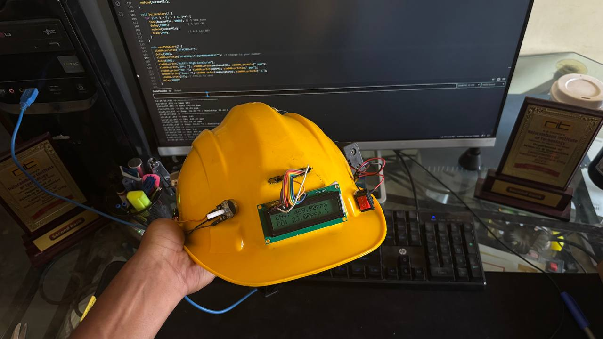
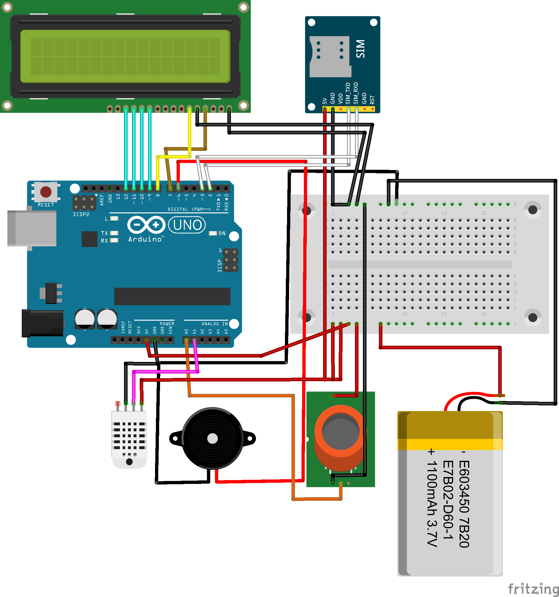

# Safety-Helmet-⛑

# Smart Safety Helmet for Underground Mine Workers

## Overview
This project is a **Smart Safety Helmet** designed to enhance the safety of underground mine workers by detecting hazardous gas concentrations (methane, carbon monoxide) and temperature changes in real-time. The system provides instant alerts via audio alarms and SMS notifications to ensure timely intervention.

## Features
- **Real-Time Monitoring**: Uses MQ-9 Gas Sensor and DHT11 Temperature Sensor.
- **Instant Alerts**: Triggers a buzzer and sends SMS alerts via the SIM800L GSM module.
- **Live Data Display**: Shows real-time data on a 16x2 LCD.

## How It Works
1. The MQ-9 sensor detects hazardous gases, and the DHT11 sensor monitors temperature.
2. If gas levels or temperature exceed safety thresholds, the system activates a buzzer and sends an SMS alert to predefined emergency contacts.
3. Real-time data is displayed on the 16x2 LCD for on-site monitoring.

## Circuit Diagram

## Code
The Arduino code for this project is available in the `Code/` folder. Upload the `Smart_Safety_Helmet.ino` file to your Arduino Uno.

## Future Scope
- Fall detection using motion sensors.
- Vital signs monitoring (e.g., heart rate, oxygen levels).
- GPS tracking for real-time location monitoring.
- Wireless dashboard for centralized monitoring.
